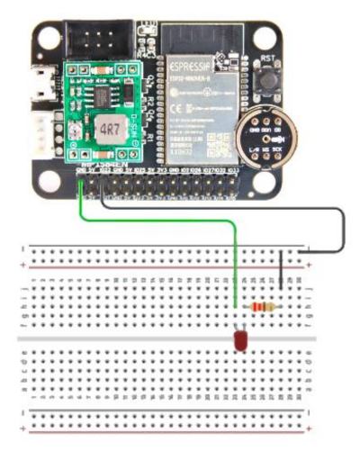
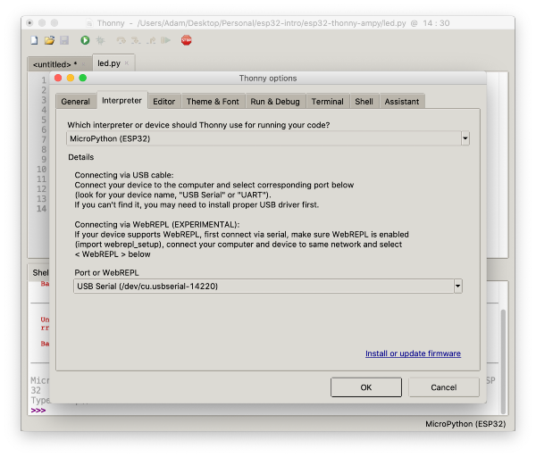

# Basic Introduction to an esp32 Board

A walkthrough of using Thonny and Ampy to connect to an ESP32 board for the first time. 

## ESP32 Drivers

Download the [ESP32 Drivers]() and walk through the installation process. Connect your ESP32 board using a USB cable. 

You will need to know the port name your board is connected to. Run the following command:

```
ls /dev/tty.*
```

The command will list your existing ports:

```
/dev/tty.Bluetooth-Incoming-Port	/dev/tty.SoundcoreLifeQ35-Spp1
/dev/tty.LEGOHubA8E2C19B5757-Ser	/dev/tty.usbserial-14220
/dev/tty.SoundcoreLifeQ35-OTA1
```

If possible, determine which port is your ESP32 board and copy it for later. 

If you are not sure which one is your board, disconnect your board, then run the list command again. Take note as to which port has been removed from the list. This is the port we will need for later. Mine port is:

```
/dev/tty.usbserial-14220
```

## LED

If your ESP32 board has an onboard LED, you can likely use pin two. If not, you will need to connect the circuit below and change the pin to 22:



Then create the following Micropython program using your favourite IDE. I would recommend [VSCode](https://code.visualstudio.com/) or [Thonny](https://thonny.org/).

```python
import time
from machine import Pin

led = Pin(2, Pin.OUT)

while True:

    led.value(1)
    time.sleep(1)

    led.value(0)
    time.sleep(1)

    print.write("Working...")
```

Next you will need to upload your program to your ESP32 board. This can be done using either of the two methods below:

## Thonny

Connect your board if it is not connected. Then follow these steps:

1. Download the [Thonny](https://thonny.org/) IDE
2. In the main menu, click ```Thonny``` and then ```Preferences...```
3. Click ```Interpreter```
4. From the first dropdown, select ```Micropython (ESP32)```
5. From the second dropdown, choose your port or the ```Try to detect port automatically``` option



6. Open your LED program
7. Click on the green play botton to uplaod your code to your ESP32 board and execute

## Ampy

A second option is to use the IDE of your choice and then use the Terminal and a small Python module called [Ampy](https://pypi.org/project/adafruit-ampy/) to upload and execute.

This process will assume you have Python and PIP instapped. 

### Python

Note that a Mac usually comes with Python installed. My Mac has Python 2 installed, so I used [Brew](https://docs.brew.sh/Homebrew-and-Python#python-3y) to install Python 3. Run the following command to see what version of Python you have installed:

```
python --version
```

If the response is Python 2, try this command:

```
python3 --version
```

If this does not work, you will need to install Python 3 using [Brew](https://docs.brew.sh/Homebrew-and-Python#python-3y).

### PIP

Check that you have PIP installed. Try the following commands:

```
pip --version
pip3 --version
python2 -m pip --version
```

If you no not have PIP installed, you can install it using [Python](https://pypi.org/project/pip/).

### Ampy

Install Ampy using the format that best worked for you, use one of the following:

```
pip install adafruit-ampy
pip3 install adafruit-ampy
python3 -m pip install adafruit-ampy
```

Then using the Terminal, navigate to the same folder as your ```led.py``` file and run the following command:

```
ampy --port /dev/tty.usbserial-14210 run led.py
```

You will need to replace the port name with your port name.

***

## Repo Resources

* [Visual Studio Code](https://code.visualstudio.com/) or [Brackets](http://brackets.io/) (or any code editor)
* [Silabs ESP32 Drivers](https://www.silabs.com/developers/usb-to-uart-bridge-vcp-drivers)
* [Thonny](https://thonny.org/)
* [Ampy](https://pypi.org/project/adafruit-ampy/)
* [LMS-ESP32](https://antonsmindstorms.com/product/wifi-python-esp32-board-for-mindstorms/)

<a href="https://codeadam.ca">

</a>
